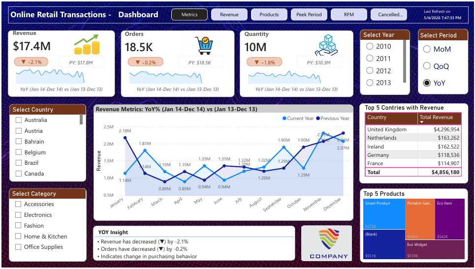
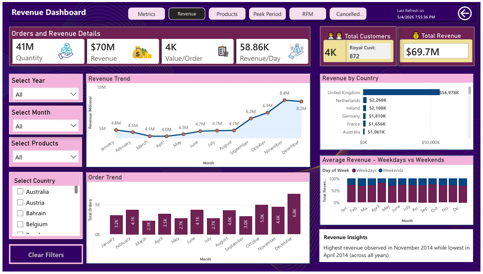
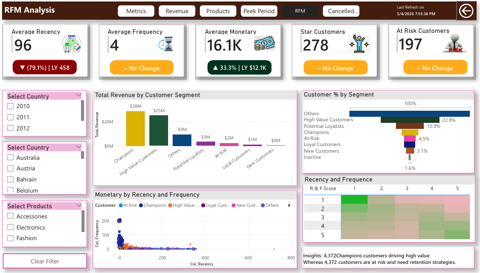

# 📊 Online Retail Analytics Dashboard

An end-to-end data analytics project that transforms raw online retail transaction data into actionable business insights using **Python, SQL, and Power BI**.

🔹 **Focus Areas:** Revenue Trends | Customer Segmentation (RFM) | Product Performance | Cancellation Analysis
🔹 **Outcome:** Interactive dashboard enabling data-driven decision making

---

## 📊 Dashboard Preview





---

## ❓ Problem Statement

Businesses often struggle to extract meaningful insights from raw transactional data, making it difficult to understand:

* Customer behavior
* Revenue patterns
* Product performance
* Order cancellations

This project solves these challenges by building a complete analytics pipeline and an interactive dashboard for business decision-making.

---

## 🎯 Objectives

* Analyze revenue trends (YoY, QoQ, MoM)
* Identify top-performing products and regions
* Detect peak sales periods (hour/day/month)
* Perform customer segmentation using **RFM analysis**
* Analyze order cancellations and identify risk factors
* Enable dynamic, filter-driven insights

---

## 🛠️ Tech Stack

| Tool     | Purpose                        |
| -------- | ------------------------------ |
| Python   | Data cleaning & preprocessing  |
| SQL      | Data modeling & transformation |
| Power BI | Data visualization & dashboard |
| DAX      | Dynamic measures & insights    |
| Excel    | Raw data source                |

---

## 🔄 Data Pipeline

### 1️⃣ Data Extraction

* Dataset sourced from online retail transactions (web dataset)

---

### 2️⃣ Data Cleaning (Python)

* Handled missing values
* Converted date formats
* Removed duplicates
* Prepared structured dataset

📄 File: `python/data_cleaning.ipynb`

---

### 3️⃣ Data Modeling (SQL)

* Created star schema:

  * `fact_sales`
  * `dim_date`
  * `dim_products`
  * `dim_customers`
* Applied relationships and constraints

📄 File: `sql/schema.sql`

---

### 4️⃣ Data Visualization (Power BI)

* Built interactive dashboards with:

  * KPI cards
  * Trend analysis
  * Heatmaps
  * RFM segmentation
  * Cancellation insights

📄 File: `powerbi/dashboard.pbix`

---

## 📊 Dashboard Pages

### 1. 📌 Metrics Overview

* Revenue, Orders, Quantity KPIs
* YoY, QoQ, MoM comparison
* Country & category filters

---

### 2. 📈 Revenue Analysis

* Monthly revenue trends
* Revenue by country
* Weekday vs weekend comparison

---

### 3. 📦 Product Analysis

* Top-selling products
* Sales trends
* Product performance by region

---

### 4. ⏱️ Peak Period Analysis

* Hourly and weekly heatmaps
* Identifies peak demand periods

---

### 5. 👥 RFM Analysis

* Customer segmentation:

  * Champions
  * Loyal Customers
  * At Risk
* Recency, Frequency, Monetary insights

---

### 6. ❌ Cancelled Orders Analysis

* Cancellation rate & volume
* Monthly trends
* Product & country-level analysis
* Business-driven insights

---

## 📈 Key Business Insights

* Revenue peaks during **Q4**, indicating strong seasonal demand
* A small number of products drive the majority of revenue (**Pareto effect**)
* Peak sales occur during **mid-day hours**
* “Champion” customers contribute significantly to total revenue
* A notable number of **at-risk customers** identified
* Cancellation trends indicate potential issues in:

  * Product quality
  * Pricing strategy
  * Delivery performance

---

## ⚙️ Advanced Techniques

* Time Intelligence (YoY, MoM, QoQ)
* RFM Customer Segmentation
* Dynamic DAX Measures (`CALCULATE`, `RANKX`, `TOPN`)
* Context-aware filtering with slicers
* Heatmap visualization for demand analysis
* Dynamic text-based insight generation

---

## 🚀 How to Use

1. Open the `.pbix` file in **Power BI Desktop**
2. Use slicers (Year, Country, Product) to filter data
3. Navigate across dashboard pages
4. Hover over visuals for detailed insights
5. Analyze KPIs and identify business trends

---

## 📁 Project Structure

```
online-transactions-analytics/
├── data/
│   ├── raw/
│   └── processed/
├── powerbi/
│   ├── Preview.pdf
│   └── dashboard.pdf
│   └── dashboard.pbix
├── python/
│   ├── data_clean.py
│   └── online_retail_transactions.ipynb
├── sql/
│   ├── schema.sql
│   └── analysis_query.sql
├── screenshots/
└── README.md
```

---

## 📌 Notes

* Power BI file is included for full interaction
* Screenshots are provided for quick preview
* Dataset used is for learning and analysis purposes

---

## 📬 Contact

If you have any questions or feedback, feel free to connect!

---

## ⭐ If you like this project

Give it a ⭐ on GitHub — it helps others discover it!
